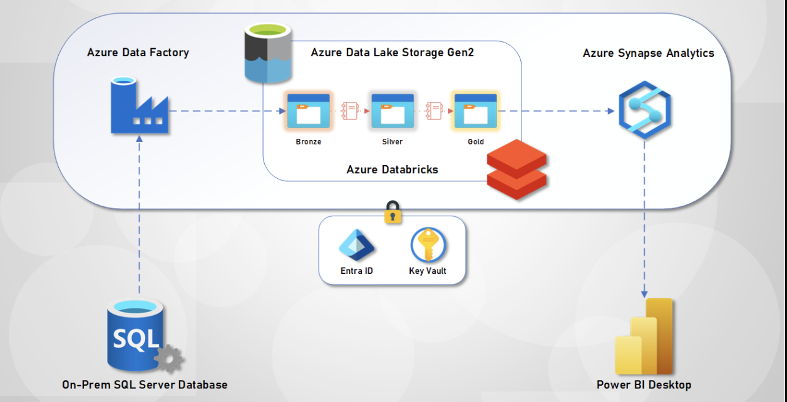
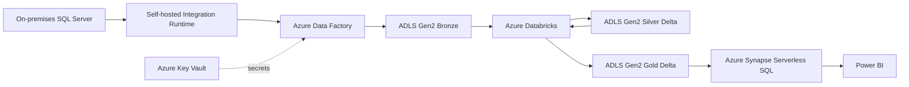

# On-Premises SQL Server to Azure Data Platform

End-to-end Azure data engineering project that migrates `AdventureWorksLT` SalesLT data from an on-premises SQL Server database into an Azure lakehouse. The pipeline lands raw data in Azure Data Lake Storage Gen2, transforms it with Azure Databricks and Delta Lake, serves curated data through Azure Synapse serverless SQL, and connects the final layer to Power BI.

## Project Walkthrough

  <video controls width="100%" poster="media/project_walkthrough_official_icons_cover.png">
    <source src="media/project_walkthrough_official_icons.mp4" type="video/mp4">
  </video>

  <a href="media/project_walkthrough_official_icons.mp4"><strong>Open MP4 walkthrough</strong></a>
  ·
  <a href="media/project_walkthrough_script.md">Read video script</a>
  ·
  <a href="media/project_walkthrough.gif">Original GIF version</a>

## Project Overview

| Area | Details |
| --- | --- |
| Source | SQL Server `AdventureWorksLT2022`, focused on the `SalesLT` schema |
| Ingestion | Azure Data Factory with a self-hosted integration runtime |
| Storage | Azure Data Lake Storage Gen2 using Bronze, Silver, and Gold layers |
| Transformation | Azure Databricks notebooks using PySpark and Delta Lake |
| Serving | Azure Synapse serverless SQL views over Gold Delta data |
| Reporting | Power BI report connected to the curated serving layer |

## What This Solves

- Moves operational SQL Server data into Azure without manual exports.
- Keeps raw, cleaned, and curated data separated with a medallion architecture.
- Uses dynamic table discovery so the ingestion pipeline can process SalesLT tables without creating one copy activity per table.
- Produces analyst-friendly Gold tables with underscore-separated column names such as `CustomerID` to `Customer_ID`.
- Lets reporting tools query curated lake data through a familiar SQL interface.

## Architecture

## Data Flow

1. **Extract**: Azure Data Factory connects to the local SQL Server database through a self-hosted integration runtime.
2. **Discover**: The ADF lookup activity reads SQL Server metadata to identify SalesLT tables.
3. **Land Bronze**: Source tables are copied into ADLS Gen2 as raw Parquet files.
4. **Build Silver**: Databricks standardizes date fields and writes cleaned Delta tables.
5. **Build Gold**: Databricks renames columns into underscore-separated analyst-friendly names and writes curated Delta tables.
6. **Serve**: Synapse serverless SQL creates views over the Gold Delta folders.
7. **Report**: Power BI connects to the Synapse serving layer for dashboarding and analysis.

## Repository Structure

| Path | Purpose |
| --- | --- |
| `azure-data-factory/` | ADF pipelines, linked services, datasets, integration runtime, trigger, and factory metadata |
| `databricks-notebooks/` | Databricks notebooks for storage mounts and Bronze-to-Silver/Silver-to-Gold transformations |
| `data-lake-storage-gen2/` | Sample Bronze, Silver, and Gold lake outputs from the project structure |
| `synapse-analytics/` | Synapse linked services, datasets, pipeline, credential, and SQL script assets |
| `power-bi-dashboard/` | Power BI report file and dashboard notes |
| `key-vault/` | Key Vault usage notes |
| `resource-group/` | Exported ARM template and architecture diagram |
| `media/` | Walkthrough video, script, covers, and Azure icon assets |
| `scripts/` | Local scripts used to generate walkthrough media |

## Key Assets

- ADF orchestration pipeline: [`azure-data-factory/pipeline/copy_all_tables.json`](azure-data-factory/pipeline/copy_all_tables.json)
- Bronze-to-Silver notebook: [`databricks-notebooks/bronze to silver.py`](databricks-notebooks/bronze%20to%20silver.py)
- Silver-to-Gold notebook: [`databricks-notebooks/silver to gold.py`](databricks-notebooks/silver%20to%20gold.py)
- Synapse view procedure: [`synapse-analytics/sqlscript/sp_CreateSQLServerlessView_gold.json`](synapse-analytics/sqlscript/sp_CreateSQLServerlessView_gold.json)
- Power BI report: [`power-bi-dashboard/pbi-e2e-de-dashboard.pbix`](power-bi-dashboard/pbi-e2e-de-dashboard.pbix)

## Setup Guide

This repository contains exported Azure assets, notebooks, documentation, media, and sample outputs. To recreate the project in your own Azure subscription, update resource names, workspace URLs, credentials, and storage paths before deployment.

1. Restore the `AdventureWorksLT2022` sample database to SQL Server.
2. Create or adapt the Azure resources using the ARM export in `resource-group/ExportedTemplate-rg-e2e-de/`.
3. Configure Azure Key Vault secrets for SQL Server, storage, and Databricks access.
4. Install and register the self-hosted integration runtime for Azure Data Factory.
5. Import or recreate the Data Factory assets from `azure-data-factory/`.
6. Import the Databricks notebooks from `databricks-notebooks/` and update storage account/container names.
7. Import the Synapse assets from `synapse-analytics/` and create serverless views over the Gold layer.
8. Open the Power BI report from `power-bi-dashboard/` and update the Synapse connection details.

## Security Notes

- Do not commit live credentials, access keys, connection strings, personal tokens, or private endpoint details.
- Use Key Vault-backed linked services for secrets wherever possible.
- Replace local development defaults with your own environment-specific parameters before running the pipeline.
- Grant each Azure service only the permissions required for its role.
- Regenerate operational screenshots and sample outputs from your own Azure run before presenting them as execution evidence.

## Future Improvements

- Replace DBFS mounts with Unity Catalog external locations.
- Add data quality checks before writing Gold tables.
- Add incremental loading instead of full overwrites.
- Add CI/CD for ADF, Databricks, and Synapse assets.
- Add cost monitoring, run telemetry, and pipeline alerting.
- Add Terraform or Bicep infrastructure-as-code modules.

## Author

Built by [ThriVikrama Rao Kavuri](https://www.linkedin.com/in/thrivikrama-rao-kavuri-7290b6147/).
